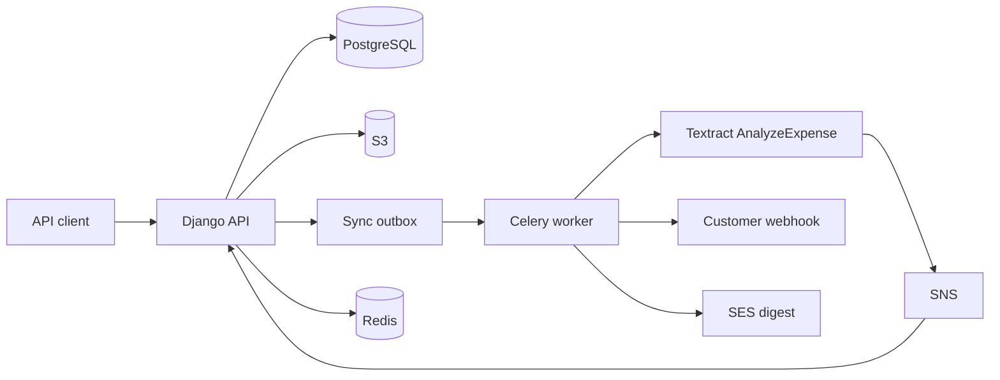

# Docintel

Backend-only document intelligence for a multi-tenant marketplace. Tenants upload invoices, AWS Textract extracts the fields, a reviewer corrects the low-confidence ones, and approval writes a sync event for downstream systems. Vendor master data arrives through the shared CSV import pipeline.

There is no frontend. The API is Django REST Framework. Work that must not run in the request is Celery.



## Run

```bash
uv sync --all-groups
cp .env.example .env
make migrate
make seed
make run
```

OpenAPI lives at `/api/docs/`. Liveness is `/healthz`, readiness is `/readyz`.

`make seed` creates two companies (`northwind`, `acme`), one user per role, a vendor, and two invoices processed by the fake Textract adapter. Local settings run tasks eagerly and store objects in memory, so this does not need AWS.

```bash
docker compose up
```

starts Postgres 16, Redis 7, the API, a worker, and beat. Add `--profile aws` for LocalStack.

## Tests

```bash
make test
```

Pytest uses PostgreSQL (`DATABASE_URL`) and the in-memory S3, Textract, and Redis stand-ins. CI also runs Postgres 16 and Redis 7 service containers.

## Layout

| Path | Role |
| --- | --- |
| `docintel/apps/core` | Tenants, JWT company claim, tool permissions, error envelope |
| `docintel/apps/sync` | Transactional outbox, webhook delivery, dead letter |
| `docintel/apps/imports` | Template, upload, preview, chunked commit |
| `docintel/apps/documents` | Upload, Textract, review, export |
| `docintel/docs` | Architecture and ADRs |

Views validate input and call a service. Services own transactions. Selectors own read queries. Adapters own AWS and HTTP.

## Decisions

1. [Async Textract with SNS and a poller](docintel/docs/adr/0001-async-textract.md)
2. [Transactional outbox](docintel/docs/adr/0002-transactional-outbox.md)
3. [Presigned uploads](docintel/docs/adr/0003-presigned-uploads.md)
4. [Tenant scoping on the manager](docintel/docs/adr/0004-tenant-manager.md)
5. [Service and selector layering](docintel/docs/adr/0005-service-layer.md)
6. [Licence policy](docintel/docs/adr/0006-licence-policy.md)

How the module attaches to tenancy, permissions, sync, and imports is in [MODULE_INTEGRATION.md](docintel/docs/MODULE_INTEGRATION.md). The runtime shape is in [ARCHITECTURE.md](docintel/docs/ARCHITECTURE.md).

## What I would do next in production

- A customer-managed KMS key per tenant, passed into the presigned POST conditions instead of one bucket key.
- A Textract spend ceiling per company (pages per day) checked before `StartExpenseAnalysis`, with the counter in Redis.
- Queue-depth autoscaling on the `ocr` queue, separate from the default queue that serves webhooks and imports.
- A consistency trigger so a child row's `company_id` cannot disagree with its parent's.
- Salt the Textract client token with a reprocess generation if a model upgrade must force a new job. Today the token is the document id, so a retry cannot double-bill and a reprocess re-reads the original job.
